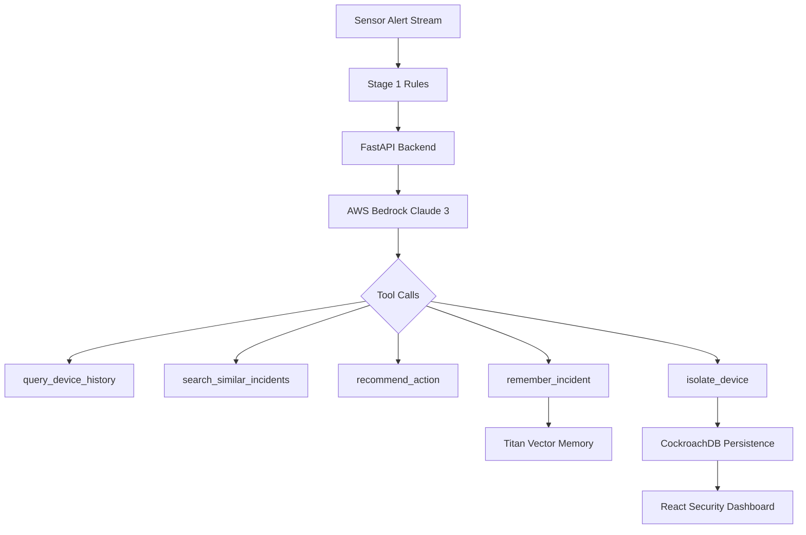

# Cyra Sentinel AI Workflow

## Detect -> Investigate -> Remember -> Act
- **Detect**: Heuristics filter high-rate SYN flood, Mimikatz commands, or vssadmin shadow copy deletion.
- **Investigate**: Bedrock Claude queries process trees, host criticality, and vector search store.
- **Remember**: Persists threat parameters and resolution steps to vector memory for future automatic matching.
- **Act**: Executes host network isolation in <500ms for High/Critical severity threats.
